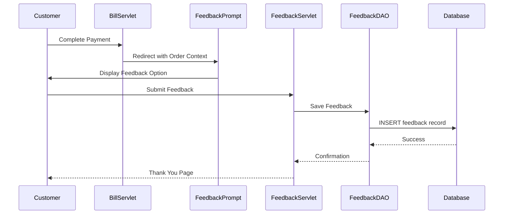

# Design Document - Customer Feedback After Payment

## Overview

This design document outlines the technical implementation for allowing customers to provide feedback immediately after completing a payment. The solution integrates with the existing CustomerFeedback system and BillServlet to create a seamless post-payment feedback experience.

## Architecture

### High-Level Flow

```
Payment Success → Feedback Prompt → Feedback Form → Validation → Database Storage → Confirmation
```

### Component Interaction



## Components and Interfaces

### 1. BillServlet Enhancement

**Purpose:** Modify existing BillServlet to redirect to feedback prompt after successful payment

**Changes:**

- Add logic to check if order has existing feedback
- Redirect to feedback prompt page with order context
- Pass order details as request attributes or URL parameters

**New Methods:**

```java
private boolean shouldShowFeedbackPrompt(int orderId)
private void redirectToFeedbackPrompt(HttpServletRequest request, HttpServletResponse response, int orderId)
```

### 2. FeedbackPromptServlet (New)

**Purpose:** Display feedback prompt page with order context

**URL Pattern:** `/feedback-prompt`

**Methods:**

- `doGet()`: Display feedback prompt with order details
- Retrieve order information from database
- Check if feedback already exists
- Forward to feedback prompt JSP

**Request Parameters:**

- `orderId` (required): The order ID for which feedback is requested

**Response:**

- Forward to `FeedbackPrompt.jsp` with order context
- Or redirect to home if feedback already exists

### 3. PostPaymentFeedbackServlet (New)

**Purpose:** Handle feedback submission from post-payment flow

**URL Pattern:** `/submit-feedback`

**Methods:**

- `doPost()`: Process feedback submission
- Validate input data
- Create CustomerFeedback object
- Save to database via CustomerFeedbackDAO
- Return success/error response

**Request Parameters:**

- `orderId` (required): Order ID
- `rating` (required): 1-5 star rating
- `comment` (optional): Customer comments
- `customerId` (optional): Customer ID if logged in

**Response:**

- JSON response with success status
- Or forward to confirmation page

### 4. CustomerFeedbackDAO Enhancement

**Purpose:** Add methods to support post-payment feedback

**New Methods:**

```java
public boolean hasFeedbackForOrder(int orderId)
public CustomerFeedback getFeedbackByOrderId(int orderId)
public boolean insertPostPaymentFeedback(CustomerFeedback feedback)
public boolean canUpdateFeedback(int feedbackId, Timestamp submittedAt)
```

### 5. Order/Bill DAO Integration

**Purpose:** Retrieve order details for feedback context

**Required Methods:**

```java
public Order getOrderById(int orderId)
public String getOrderItemsSummary(int orderId)
public Customer getCustomerByOrderId(int orderId)
```

## Data Models

### CustomerFeedback Model (Existing - No Changes)

The existing `CustomerFeedback` model already supports all required fields:

- `feedbackId`: Auto-generated primary key
- `customerId`: Customer identifier (or "GUEST\_" + orderId for guests)
- `customerName`: Customer name from order
- `orderId`: Associated order ID
- `orderDate`: Date of order
- `orderTime`: Time of order
- `rating`: 1-5 star rating
- `comment`: Optional feedback text
- `feedbackDate`: Date feedback was submitted
- `pizzaOrdered`: Summary of items ordered
- `hasResponse`: Boolean indicating if manager responded
- `response`: Manager's response text
- `createdAt`: Timestamp of creation
- `updatedAt`: Timestamp of last update

### FeedbackSource Enhancement (Optional)

Consider adding a `source` field to track feedback origin:

```sql
ALTER TABLE customer_feedback ADD source VARCHAR(50) DEFAULT 'MANUAL';
-- Values: 'POST_PAYMENT', 'MANUAL', 'EMAIL', 'SURVEY'
```

## User Interface Design

### 1. Feedback Prompt Page (`FeedbackPrompt.jsp`)

**Layout:**

```
+------------------------------------------+
|  ✓ Payment Successful!                   |
|                                          |
|  Order #12345                            |
|  Total: $45.99                           |
|  Items: Margherita Pizza, Pepperoni...   |
|                                          |
|  +------------------------------------+  |
|  | How was your experience?           |  |
|  |                                    |  |
|  | [Rate Your Experience Button]      |  |
|  |                                    |  |
|  | [Skip for Now]                     |  |
|  +------------------------------------+  |
|                                          |
|  [Continue to Home]                      |
+------------------------------------------+
```

**Features:**

- Clean, minimal design
- Clear order summary
- Prominent "Rate Your Experience" button
- Option to skip
- Auto-redirect after 10 seconds if no action

### 2. Feedback Form Modal/Page (`FeedbackForm.jsp`)

**Layout:**

```
+------------------------------------------+
|  Rate Your Experience                    |
|                                          |
|  Order #12345 - Margherita Pizza         |
|                                          |
|  Your Rating: *                          |
|  ☆ ☆ ☆ ☆ ☆                              |
|                                          |
|  Tell us more (optional):                |
|  +------------------------------------+  |
|  |                                    |  |
|  |                                    |  |
|  |                                    |  |
|  +------------------------------------+  |
|  500 characters remaining                |
|                                          |
|  [Submit Feedback]  [Cancel]             |
+------------------------------------------+
```

**Features:**

- Large, touch-friendly star buttons
- Real-time character counter
- Validation messages
- Loading state during submission
- Mobile-responsive layout

### 3. Confirmation Page (`FeedbackConfirmation.jsp`)

**Layout:**

```
+------------------------------------------+
|  ✓ Thank You for Your Feedback!          |
|                                          |
|  We appreciate you taking the time to    |
|  share your experience with us.          |
|                                          |
|  Your feedback helps us improve our      |
|  service and menu offerings.             |
|                                          |
|  [View Order History]                    |
|  [Return to Home]                        |
|                                          |
|  Redirecting in 5 seconds...             |
+------------------------------------------+
```

**Features:**

- Positive confirmation message
- Clear next steps
- Auto-redirect to home page
- Different message for low ratings (1-2 stars)

## Error Handling

### Validation Errors

1. **Missing Rating:**

   - Message: "Please select a rating before submitting"
   - Action: Highlight star rating section

2. **Comment Too Long:**

   - Message: "Comment exceeds 500 characters"
   - Action: Trim text and show character count

3. **Invalid Order ID:**
   - Message: "Order not found"
   - Action: Redirect to home page

### Database Errors

1. **Duplicate Feedback:**

   - Check before displaying form
   - Show message: "You've already provided feedback for this order"
   - Offer option to view/edit existing feedback

2. **Save Failure:**
   - Message: "Unable to save feedback. Please try again."
   - Action: Keep form data, allow retry
   - Log error for investigation

### Session/Authentication Errors

1. **Guest Customer:**

   - Allow feedback without login
   - Use order details for customer info
   - Create guest customer ID: "GUEST\_" + orderId

2. **Session Expired:**
   - Still allow feedback submission
   - Use order context from URL parameters

## Testing Strategy

### Unit Tests

1. **CustomerFeedbackDAO Tests:**

   - Test `hasFeedbackForOrder()`
   - Test `insertPostPaymentFeedback()`
   - Test `canUpdateFeedback()`
   - Test guest customer ID generation

2. **Validation Tests:**
   - Test rating validation (1-5 range)
   - Test comment length validation
   - Test required field validation

### Integration Tests

1. **End-to-End Flow:**

   - Complete payment → See prompt → Submit feedback → Verify in database
   - Test with logged-in customer
   - Test with guest customer

2. **Duplicate Prevention:**

   - Submit feedback for order
   - Attempt to submit again
   - Verify second attempt is blocked

3. **Manager Dashboard Integration:**
   - Submit post-payment feedback
   - Verify appears in manager dashboard
   - Verify statistics are updated

### UI/UX Tests

1. **Responsive Design:**

   - Test on mobile devices (320px - 768px)
   - Test on tablets (768px - 1024px)
   - Test on desktop (1024px+)

2. **Accessibility:**

   - Test keyboard navigation
   - Test screen reader compatibility
   - Test color contrast ratios

3. **User Flow:**
   - Test skip functionality
   - Test auto-redirect timing
   - Test back button behavior

## Security Considerations

1. **Input Validation:**

   - Sanitize all user input (rating, comments)
   - Prevent SQL injection via prepared statements
   - Prevent XSS attacks by escaping output

2. **Order Verification:**

   - Verify order belongs to customer (if logged in)
   - Validate order ID exists in database
   - Check order status is "completed" or "paid"

3. **Rate Limiting:**

   - Limit feedback submissions per IP address
   - Prevent spam submissions
   - Track submission timestamps

4. **Data Privacy:**
   - Store only necessary customer information
   - Comply with data retention policies
   - Allow customers to delete their feedback

## Performance Considerations

1. **Database Queries:**

   - Use indexed queries for order lookup
   - Cache order details during feedback flow
   - Optimize feedback insertion query

2. **Page Load Time:**

   - Minimize JavaScript bundle size
   - Lazy load feedback form
   - Use CDN for static assets

3. **Concurrent Submissions:**
   - Handle multiple simultaneous submissions
   - Use database transactions
   - Implement optimistic locking if needed

## Deployment Plan

### Phase 1: Backend Implementation

- Enhance CustomerFeedbackDAO
- Create FeedbackPromptServlet
- Create PostPaymentFeedbackServlet
- Add database migrations (if needed)

### Phase 2: Frontend Implementation

- Create FeedbackPrompt.jsp
- Create FeedbackForm.jsp
- Create FeedbackConfirmation.jsp
- Add JavaScript for star rating interaction

### Phase 3: Integration

- Modify BillServlet to redirect to feedback prompt
- Test end-to-end flow
- Verify manager dashboard integration

### Phase 4: Testing & Refinement

- Conduct user acceptance testing
- Fix bugs and issues
- Optimize performance

### Phase 5: Production Deployment

- Deploy to production environment
- Monitor feedback submission rates
- Gather user feedback on the feature

## Monitoring and Metrics

### Key Metrics to Track

1. **Feedback Submission Rate:**

   - Percentage of orders with feedback
   - Target: 30-40% submission rate

2. **Average Rating:**

   - Track average rating over time
   - Compare post-payment vs. other feedback sources

3. **Time to Submit:**

   - Measure time between payment and feedback submission
   - Identify optimal prompt timing

4. **Completion Rate:**

   - Track how many customers start vs. complete feedback
   - Identify drop-off points

5. **Device Distribution:**
   - Track mobile vs. desktop submissions
   - Optimize for most common devices

### Monitoring Tools

- Application logs for errors
- Database query performance monitoring
- User analytics (Google Analytics or similar)
- A/B testing for prompt variations

## Future Enhancements

1. **Incentivized Feedback:**

   - Offer discount code for feedback submission
   - Loyalty points for detailed feedback

2. **Photo Upload:**

   - Allow customers to upload food photos
   - Moderate and display photos in feedback

3. **Follow-up Questions:**

   - Dynamic questions based on rating
   - Specific questions about food quality, service, etc.

4. **Email Reminders:**

   - Send email reminder if feedback not provided
   - Include direct link to feedback form

5. **Social Sharing:**
   - Allow customers to share positive reviews
   - Integration with social media platforms
