# 1.1 Overall Architectural Diagram - Restaurant Management System

## Mermaid Diagram (Render in GitHub/VS Code/Markdown viewers)

```mermaid
graph TB
    subgraph Client["Client Layer"]
        Browser["🌐 Web Browser"]
    end

    subgraph WebLayer["Presentation Layer - JSP Views"]
        JSP1["📄 pos.jsp"]
        JSP2["📄 ManageProduct.jsp"]
        JSP3["📄 ManageOrders.jsp"]
        JSP4["📄 ChefMonitor.jsp"]
        JSP5["📄 CustomerFeedback.jsp"]
        JSP6["📄 ManageCategory.jsp"]
        JSP7["📄 Dashboard.jsp"]
        JSP8["📄 + More JSP Pages..."]
    end

    subgraph ControllerLayer["Controller Layer - Servlets (50+ Servlets)"]
        direction LR
        subgraph Auth["🔐 Authentication"]
            S1["LoginServlet"]
            S2["SignupServlet"]
            S3["LogoutServlet"]
            S4["ForgotPasswordServlet"]
        end
        
        subgraph Product["📦 Product Management"]
            S5["ManageProductServlet"]
            S6["AddProductServlet"]
            S7["EditProductServlet"]
            S8["DeleteProductServlet"]
            S9["ViewProductSizesServlet"]
        end
        
        subgraph Order["🛒 Order & POS"]
            S10["POSServlet"]
            S11["ManageOrderServlet"]
            S12["OrderController"]
            S13["ChefMonitorServlet"]
            S14["WaiterDashboardServlet"]
        end
        
        subgraph Payment["💳 Payment & Billing"]
            S15["PaymentServlet"]
            S16["BillServlet"]
            S17["DiscountServlet"]
        end
        
        subgraph Feedback["⭐ Feedback"]
            S18["CustomerFeedbackServlet"]
            S19["FeedbackFormServlet"]
            S20["PostPaymentFeedbackServlet"]
        end
        
        subgraph Inventory["📊 Inventory"]
            S21["InventoryServlet"]
            S22["InventoryMonitorServlet"]
        end
        
        subgraph Reports["📈 Reports & Analytics"]
            S23["SalesReportServlet"]
            S24["DashboardController"]
            S25["ManagerDashboardServlet"]
        end
        
        subgraph Other["🔧 Other Features"]
            S26["ChatBotServlet"]
            S27["TableServlet"]
            S28["ManageCategoryServlet"]
        end
    end

    subgraph Utils["Utility Layer"]
        U1["📧 EmailUtil"]
        U2["📊 ExcelExportUtil"]
        U3["📄 PDFExportUtil"]
        U4["🤖 GeminiAPI"]
        U5["⚙️ Config"]
        U6["🔗 URLUtils"]
    end

    subgraph DAOLayer["Data Access Layer - DAOs (20+ DAOs)"]
        direction LR
        DAO1["ProductDAO"]
        DAO2["OrderDAO"]
        DAO3["OrderDetailDAO"]
        DAO4["CustomerDAO"]
        DAO5["EmployeeDAO"]
        DAO6["CategoryDAO"]
        DAO7["InventoryDAO"]
        DAO8["PaymentDAO"]
        DAO9["FeedbackDAO"]
        DAO10["DiscountDAO"]
        DAO11["TableDAO"]
        DAO12["ToppingDAO"]
        DAO13["UserDAO"]
        DAO14["+ 10+ More DAOs..."]
    end

    subgraph ModelLayer["Model Layer - POJOs (20+ Models)"]
        direction LR
        M1["Product"]
        M2["Order"]
        M3["OrderDetail"]
        M4["Customer"]
        M5["Employee"]
        M6["Category"]
        M7["Inventory"]
        M8["Payment"]
        M9["Feedback"]
        M10["Discount"]
        M11["Table"]
        M12["Topping"]
        M13["+ 15+ More Models..."]
    end

    subgraph DBLayer["Database Layer"]
        DB[("💾 SQL Server Database<br/>━━━━━━━━━━━━━━<br/>Tables:<br/>• Products<br/>• Orders<br/>• OrderDetails<br/>• Customers<br/>• Employees<br/>• Categories<br/>• Inventory<br/>• Payments<br/>• Feedback<br/>• Discounts<br/>• Tables<br/>• Toppings<br/>+ More...")]
        DBContext["🔌 DBContext<br/>(Connection Manager)"]
    end

    subgraph Filter["Security Layer"]
        RF["🛡️ RoleFilter<br/>(Access Control)"]
    end

    Browser -->|HTTP Request| RF
    RF --> ControllerLayer
    ControllerLayer --> WebLayer
    WebLayer -->|HTTP Response| Browser
    
    ControllerLayer <--> Utils
    ControllerLayer <--> ModelLayer
    ControllerLayer --> DAOLayer
    
    DAOLayer <--> ModelLayer
    DAOLayer --> DBContext
    DBContext --> DB

    style Browser fill:#e1f5ff
    style WebLayer fill:#fff3e0
    style ControllerLayer fill:#f3e5f5
    style Utils fill:#e8f5e9
    style DAOLayer fill:#fce4ec
    style ModelLayer fill:#fff9c4
    style DBLayer fill:#e0f2f1
    style Filter fill:#ffebee
```

## Key Features by Module:

### 1. Authentication & User Management
- Login/Logout/Signup
- Password Recovery (ForgotPassword)
- User Profile Management
- Role-based Access Control (RoleFilter)

### 2. Product Management
- Add/Edit/Delete Products
- Product Size Management
- Category Management
- Product-Ingredient Mapping

### 3. Order Management (POS System)
- Point of Sale (POS)
- Order Creation & Tracking
- Order Status Flow
- Table Assignment
- Chef Monitor
- Waiter Dashboard

### 4. Inventory Management
- Stock Monitoring
- Inventory Alerts
- Product-Ingredient Tracking

### 5. Payment & Billing
- Payment Processing
- Bill Generation
- Discount Application

### 6. Customer Feedback
- Feedback Collection
- Post-Payment Feedback
- Feedback Analytics

### 7. Reporting & Analytics
- Sales Reports
- Dashboard (Manager/Waiter)
- Revenue Tracking
- Top Products Analysis

### 8. Additional Features
- ChatBot Integration (Gemini API)
- Email Notifications
- Excel/PDF Export
- Table Locking System
- Topping System

## Technology Stack:
- **Backend**: Java Servlets, JSP
- **Database**: Microsoft SQL Server
- **Server**: Jakarta EE (Servlet 5.0/6.0)
- **Build Tool**: Apache Ant (NetBeans)
- **Libraries**: Jakarta Mail, BCrypt, Apache POI, Log4j, JSON
